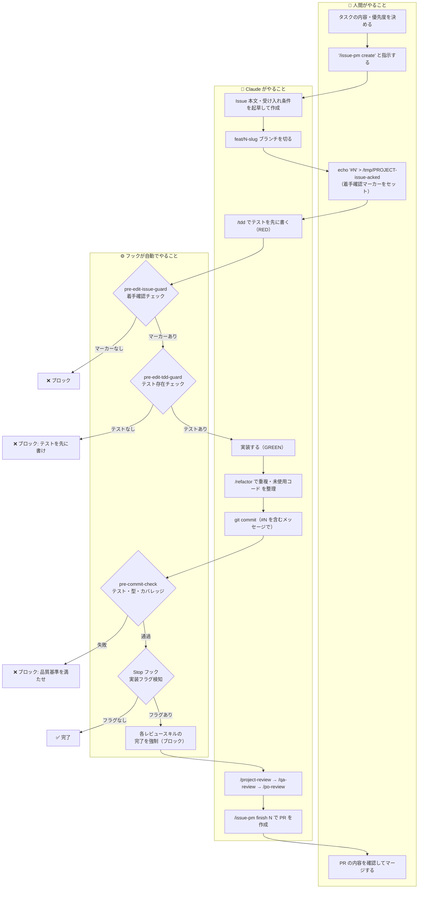
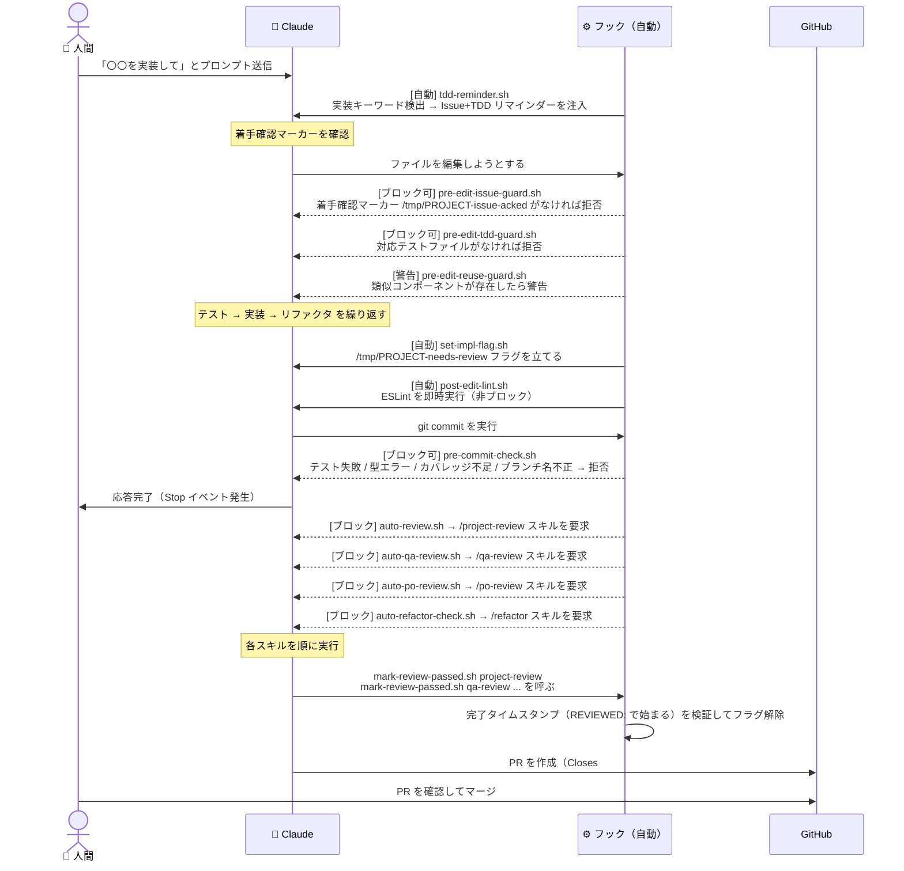

# Claude Code プロジェクト設定テンプレート

新規プロジェクトへ Claude Code の設定ファイル一式を持ち込むためのテンプレートリポジトリ。  
TDD・Issue 駆動開発・多段レビューゲートを **Claude が自律的に守るよう強制する仕組み** です。

## このテンプレートで実現できること

| 自動化 | 仕組み | タイミング |
|---|---|---|
| Issue 着手確認 | 着手確認マーカーなしで実装ファイルを編集しようとするとブロック | 編集前 |
| TDD 強制 | テストなしで実装ファイルを編集しようとするとブロック | 編集前 |
| 既存資産の再発明警告 | 類似コンポーネント・モジュールが存在する場合に警告 | 編集前 |
| コミット品質ゲート | テスト・型チェック・カバレッジを自動実行 | `git commit` 前 |
| git commit ブランチ番号強制 | ブランチ名・コミットメッセージに issue 番号がなければブロック | コミット時 |
| ESLint 早期チェック | ファイル保存後に Lint を即時実行 | 編集後 |
| 多段レビューゲート強制 | 実装変更後に `/project-review`・`/qa-review`・`/po-review`・`/refactor` の全完了を強制 | Claude 応答終了時 |
| デザインチェック強制 | 画面変更後にデザイン規約チェックを強制 | Claude 応答終了時 |
| レビュースキップ防止 | `touch` でのフラグ偽装をブロック。`mark-review-passed.sh` 経由のみ完了記録可能 | 常時 |
| セッションノートバックアップ | git log・差分をファイルに自動保存 | コンテキスト圧縮前 |
| TDD リマインダー | 実装キーワード検出時に Issue 番号・TDD 手順をコンテキストへ注入 | プロンプト送信時 |

---

## 開発フロー全体図（人間 vs Claude vs 自動フック）



### 人間・Claude・フックの役割分担

| 役割 | 担当 | 具体的な作業 |
|---|---|---|
| **👤 人間** | 意思決定・方向づけ | タスクの内容と優先度を決める・着手確認マーカーをセット・PR をマージする |
| **🤖 Claude** | 実装作業全般 | Issue 作成・ブランチ切り・テスト記述・実装・コミット・レビュー・PR 作成 |
| **⚙️ フック** | ルール強制・自動チェック | TDD 遵守・Issue 紐付け・品質ゲート・レビュー強制（Claude をブロックする） |

> **キーポイント**: 人間がやることは「何を作るか」の判断と最終承認のみ。  
> Claude が「どう作るか」を実行し、フックが Claude のルール逸脱を機械的に防ぎます。

---

## フック ライフサイクル（1 ターンの詳細）



---

## レビューゲートの仕組み（不正防止付き）

実装ファイル（`.ts`/`.tsx`/`.py`）を変更すると Stop フックが複数のレビューを要求します。直接 `touch` でフラグを偽装することはできません。

```mermaid
flowchart LR
    subgraph PostToolUse
        A[実装ファイル変更] --> B[set-impl-flag.sh]
        B --> C[/tmp/PROJECT-needs-review\n/tmp/PROJECT-needs-qa-review\n/tmp/PROJECT-needs-po-review\n/tmp/PROJECT-needs-refactor]
    end

    subgraph Stop Hook
        C --> D{フラグ検知}
        D -- あり --> E[ブロック: スキル実行を要求]
    end

    subgraph スキル実行
        E --> F[/project-review 実行]
        E --> G[/qa-review 実行]
        E --> H[/po-review 実行]
        E --> I[/refactor 実行]
        F & G & H & I --> J[mark-review-passed.sh\n各スキル名を引数で呼ぶ]
        J --> K["/tmp/PROJECT-*-passed\nREVIEWED:タイムスタンプ を書き込み\n（touch では書けない形式）"]
    end

    subgraph 完了確認
        K --> L{Stop Hook 再検査}
        L -- passed ファイルに REVIEWED: あり --> M[フラグ削除: 通過]
        L -- REVIEWED: なし / touch のみ --> N[ブロック: 不正を拒否]
    end
```

> **不正防止の仕組み**: `settings.json` の deny リストで `touch /tmp/*-passed` を禁止しています。  
> `mark-review-passed.sh` だけが `REVIEWED:` で始まる完了タイムスタンプを書き込めます。  
> Stop フックはこのプレフィックスの存在を確認するため、`touch` で空ファイルを作っても通過できません。

---

## リポジトリ構成

```
.
├── README.md
├── CLAUDE.md                              Claude が最初に読むプロジェクトコンテキスト
└── .claude/
    ├── settings.json                      Claude Code 設定（権限・フック定義・PROJECT_NAME）
    ├── git-hooks/
    │   └── commit-msg                     コミットメッセージ検証（issue 番号必須化）
    ├── hooks/                             Claude Code フック群（18 スクリプト）
    │   ├── session-start.sh
    │   ├── pre-commit-check.sh
    │   ├── pre-edit-issue-guard.sh
    │   ├── pre-edit-tdd-guard.sh
    │   ├── pre-edit-reuse-guard.sh
    │   ├── post-edit-lint.sh
    │   ├── set-impl-flag.sh
    │   ├── set-screen-flag.sh
    │   ├── set-screenshot-flag.sh
    │   ├── auto-review.sh
    │   ├── auto-qa-review.sh
    │   ├── auto-po-review.sh
    │   ├── auto-refactor-check.sh
    │   ├── auto-design-check.sh
    │   ├── auto-screenshot-check.sh
    │   ├── mark-review-passed.sh
    │   ├── pre-compact-backup.sh
    │   └── tdd-reminder.sh
    ├── rules/                             実装品質ルール分離先（プロジェクト固有 .md を追加）
    │   └── README.md
    └── skills/                            Claude Code スキル（/コマンド）
        ├── tdd/                           TDD ワークフロー
        │   ├── SKILL.md
        │   └── examples.md
        ├── project-review/SKILL.md        コミット前チェックリスト
        ├── refactor/SKILL.md              実装後リファクタゲート
        ├── qa-review/SKILL.md             テストシナリオ QA レビュー
        ├── po-review/SKILL.md             PO 視点レビュー（現場ニーズ整合）
        ├── design-system/SKILL.md         デザインシステム規約
        ├── design-check/SKILL.md          デザイン規約自動スキャン
        ├── issue-pm/                      Issue 駆動開発 PM
        │   ├── SKILL.md
        │   └── templates.md
        ├── issue-progress/                GitHub Projects 進捗管理
        │   ├── SKILL.md
        │   └── project-cache.json
        ├── coverage-check/SKILL.md        カバレッジ確認
        ├── config-audit/SKILL.md          Claude 設定健全性チェック
        ├── new-component/SKILL.md         コンポーネント雛形生成
        ├── new-screen/SKILL.md            画面雛形生成
        ├── storybook-check/SKILL.md       Storybook カバレッジ確認
        └── uiux-check/                    Playwright UI/UX 検査
            ├── SKILL.md
            └── scripts/tour.mjs
```

---

## 各ファイルの役割

### CLAUDE.md

Claude がセッション開始時に最初に読むファイル。プロジェクトの概要・確定方針・開発ルール・スキル一覧を記述する。**このファイルはプロジェクト固有のため、テンプレートを参考に全面書き換えが必要。**

### .claude/settings.json

Claude Code の設定ファイル。以下を定義する。

- `env.PROJECT_NAME` — **プロジェクト名（フックのフラグファイル名に使用）。必ず変更すること**
- `permissions.allow` — 確認なしで実行できるコマンド（git, npm, gh など）
- `permissions.deny` — 常にブロックするコマンド（force push, rm -rf, touch による review 偽装など）
- `hooks` — Claude のライフサイクルイベントに紐付くフックスクリプトの登録

フックのパスはすべて `$CLAUDE_PROJECT_DIR` で解決するため、プロジェクトのルートパスに依存しない。

### .claude/git-hooks/commit-msg

Issue ブランチ（`feat/N-*`, `fix/N-*` 等）でのコミット時に、メッセージに `#N` が含まれているかを検証する git フック。`session-start.sh` が `git config core.hooksPath .claude/git-hooks` を自動設定するため、手動での git フック設定は不要。

### .claude/hooks/ — フック群（18 スクリプト）

| フック | イベント | 役割 | ブロック？ |
|---|---|---|---|
| `session-start.sh` | SessionStart | npm install・git hook 設定・Playwright ブラウザセットアップ | — |
| `pre-edit-issue-guard.sh` | PreToolUse(Edit\|Write) | 着手確認マーカー `/tmp/$PROJECT_NAME-issue-acked` がなければ実装ファイル編集をブロック | Yes |
| `pre-edit-tdd-guard.sh` | PreToolUse(Edit\|Write) | `src/lib/` / `src/features/` 編集前に対応テストの存在を確認 | Yes |
| `pre-edit-reuse-guard.sh` | PreToolUse(Edit\|Write) | 新規ファイル作成時に類似の既存コンポーネント・モジュールを警告 | 警告のみ |
| `pre-commit-check.sh` | PreToolUse(Bash) | git commit 前にテスト・型チェック・カバレッジを実行してブロック | Yes |
| `set-impl-flag.sh` | PostToolUse | 実装ファイル変更時にレビュー要求フラグを立てる | — |
| `set-screen-flag.sh` | PostToolUse | 画面ファイル変更時に `/tmp/$PROJECT_NAME-needs-design-check` フラグを立てる | — |
| `set-screenshot-flag.sh` | PostToolUse | レイアウトファイル変更時に `/tmp/$PROJECT_NAME-needs-screenshot-check` フラグを立てる | — |
| `post-edit-lint.sh` | PostToolUse | ファイル保存後に ESLint を実行して早期エラー検出 | 警告のみ |
| `auto-review.sh` | Stop | フラグを検知して `/project-review` スキルの実行を強制 | Yes |
| `auto-qa-review.sh` | Stop | フラグを検知して `/qa-review` スキルの実行を強制 | Yes |
| `auto-po-review.sh` | Stop | フラグを検知して `/po-review` スキルの実行を強制 | Yes |
| `auto-refactor-check.sh` | Stop | フラグを検知して `/refactor` スキルの実行を強制 | Yes |
| `auto-design-check.sh` | Stop | フラグを検知して `/design-check` スキルの実行を強制 | Yes |
| `auto-screenshot-check.sh` | Stop | フラグを検知してスクリーンショット確認を強制 | Yes |
| `mark-review-passed.sh` | 手動呼び出し | レビュー完了を記録するスクリプト。`touch` では通過できない形式で書き込む | — |
| `pre-compact-backup.sh` | PreCompact | コンテキスト圧縮前に git log と差分を `.claude/session-notes/` へ保存 | — |
| `tdd-reminder.sh` | UserPromptSubmit | 実装キーワードを含むプロンプト提出時に TDD リマインダーをコンテキストへ注入 | — |

### .claude/rules/ — 実装品質ルール

CLAUDE.md が肥大化しないように、再発防止ルールやドメイン固有の実装規約をここに分離する。  
プロジェクト固有の `.md` ファイルを追加し、CLAUDE.md から `@.claude/rules/xxx.md` で参照する。

```
.claude/rules/
├── README.md               （ルール追加方法の説明）
├── p0-bug-patterns.md      （例: TDD をすり抜けた P0 バグの再発防止）
└── <domain>-rules.md       （例: DB スキーマ変更ルール・命名規約など）
```

### .claude/skills/ — スキル群（/コマンド）

`/スキル名` で呼び出せるプロジェクト固有のスラッシュコマンド。各スキルは `SKILL.md` に手順・チェックリストを記述する。

| スキル | 用途 | 自動発火 |
|---|---|---|
| `/tdd` | TDD ワークフロー（Red→Green→Refactor）| — |
| `/project-review` | コミット前チェックリスト（テスト・型・デザイン・セキュリティ）| Stop フック |
| `/refactor` | 重複・未使用コード・肥大化・再発明スキャンと整理 | Stop フック |
| `/qa-review` | テストシナリオが実運用に沿っているか QA 視点でレビュー | Stop フック |
| `/po-review` | 機能・実装が現場の運用ニーズと合っているか PO 視点でレビュー | Stop フック |
| `/design-system` | デザインシステム規約クイックリファレンス | — |
| `/design-check` | 画面変更後のデザインシステム規約スキャン | Stop フック |
| `/issue-pm` | Issue 作成・ブランチ管理・PR 作成の一元管理 | — |
| `/issue-progress` | GitHub Projects 進捗管理（ステータス更新・ボード表示）| — |
| `/coverage-check` | テストカバレッジ確認・未テストパスへのテスト追加 | — |
| `/config-audit` | .claude/ 設定ファイルの健全性チェック | — |
| `/new-component` | コンポーネント + ストーリー + テストの雛形生成 | — |
| `/new-screen` | App Router ページの雛形生成 | — |
| `/storybook-check` | Storybook ストーリーカバレッジ確認・補完 | — |
| `/uiux-check` | Playwright による実画面 UI/UX 検査 | — |

> **スキルの内容はプロジェクト固有の部分が多い。** 特に `project-review`・`design-system`・`tdd` はカバレッジ閾値やチェック項目をプロジェクトに合わせて書き換えること。

---

## 新規プロジェクトへのセットアップ手順

### Step 1: ファイルをコピーする

このリポジトリを「Use this template」でフォークするか、手動でコピーする。

```bash
# 手動コピーの場合
git clone https://github.com/m-kuwata/claude-project-template tmp-template
cp -r tmp-template/CLAUDE.md ./CLAUDE.md
cp -r tmp-template/.claude ./.claude
rm -rf tmp-template
```

### Step 2: フックに実行権限を付与する

```bash
chmod +x .claude/hooks/*.sh
chmod +x .claude/git-hooks/commit-msg
```

### Step 3: PROJECT_NAME を設定する（最重要）

**最初に必ず行う。** `.claude/settings.json` の `env.PROJECT_NAME` をプロジェクト名に変更する。

```json
{
  "env": {
    "PROJECT_NAME": "your-project-name"
  }
}
```

フラグファイル（`/tmp/$PROJECT_NAME-needs-review` 等）の名前空間として使われる。  
複数プロジェクトを同時に開いている場合に衝突を防ぐため、**プロジェクト固有の名前にすること。**

### Step 4: CLAUDE.md を書く

`CLAUDE.md` をプロジェクト固有の内容に書き換える。最低限以下を記載すること。

- プロジェクトの概要・目的
- 確定方針（変更に合意が必要なもの）
- 技術スタック
- 開発ルール（TDD・Issue 駆動開発など）
- 使用するスキルの一覧

> CLAUDE.md は **200 行以内** を目安にする。それ以上になる場合は `.claude/rules/` に分離する。

### Step 5: settings.json をカスタマイズする

`$CLAUDE_PROJECT_DIR` はそのまま使える。必要に応じて以下を調整する。

- `permissions.allow` にプロジェクト固有のコマンドを追加

```json
"Bash(python *)",
"Bash(docker *)",
"Bash(pnpm *)",
"Bash(uv run *)"
```

- 使わないフックのエントリを `hooks` セクションから削除

### Step 6: フックをカスタマイズする

**変更が必要なフック:**

| フック | 変更点 |
|---|---|
| `pre-commit-check.sh` | テストコマンド（`npm run test:run` → `pnpm test:run` 等）・カバレッジ閾値 |
| `pre-edit-tdd-guard.sh` | TDD 対象ディレクトリ（`src/lib/` / `src/features/` 以外を使う場合） |
| `post-edit-lint.sh` | Lint コマンド（eslint 以外を使う場合） |
| `set-screen-flag.sh` | 画面ファイルのパスパターン |
| `set-screenshot-flag.sh` | スクリーンショットチェック対象のファイルパターン |
| `auto-screenshot-check.sh` | スクリーンショット手順（確認対象のルートを修正） |
| `tdd-reminder.sh` | 実装キーワード（日本語・英語を混在させる場合は調整） |

**汎用的でそのまま使えるフック:**

- `session-start.sh`（npm → pnpm の場合はパッケージマネージャを修正）
- `pre-edit-issue-guard.sh`
- `pre-edit-reuse-guard.sh`
- `pre-compact-backup.sh`
- `mark-review-passed.sh`
- `auto-review.sh` / `auto-qa-review.sh` / `auto-po-review.sh` / `auto-refactor-check.sh` / `auto-design-check.sh`

### Step 7: スキルをカスタマイズする

**必ず書き換えるもの:**

- `project-review/SKILL.md` → プロジェクト固有のチェックリストに変更
- `design-system/SKILL.md` → プロジェクトのデザイントークン・規約に変更
- `issue-progress/project-cache.json` → `/issue-progress setup` で再生成

**内容を確認・調整すれば使えるもの:**

- `tdd/SKILL.md` → テストコマンドと閾値を調整
- `issue-pm/SKILL.md` → ブランチ命名規則・PR フォーマットを確認
- `coverage-check/SKILL.md` → カバレッジ閾値を調整
- `new-component/SKILL.md` → コンポーネント配置先パスを調整
- `new-screen/SKILL.md` → 画面ルートとレイアウト構成を調整
- `uiux-check/scripts/tour.mjs` → 巡回するルート一覧を調整

**Storybook を使わない場合:**

```bash
# storybook-check スキルを無効化（スキルファイルの冒頭に追記）
echo '> このプロジェクトでは Storybook を使用しません。' >> .claude/skills/storybook-check/SKILL.md
```

### Step 8: rules/ にプロジェクト固有ルールを追加する（推奨）

再発防止パターンや命名規約など、CLAUDE.md に書くには詳細すぎるルールを分離する。

```bash
# 例: P0 バグの再発防止パターンを追加
cat > .claude/rules/p0-bug-patterns.md << 'EOF'
# P0 バグ再発防止パターン

## [バグの種類]
- 問題: [何が起きたか]
- ルール: [類似実装時に確認すること]
EOF
```

そして CLAUDE.md に参照を追記する：

```md
詳細な再発防止パターン: @.claude/rules/p0-bug-patterns.md
```

### Step 9: GitHub Projects のセットアップ（issue-progress スキルを使う場合）

1. GitHub Projects v2 でプロジェクトを作成
2. Status フィールドに `未着手` / `作業中` / `レビュー中` / `完了` のオプションを追加
3. リポジトリ Settings > Secrets に `PROJECT_TOKEN` を設定（スコープ: `repo` + `project`）
4. `/issue-progress setup` を実行して `project-cache.json` を再生成

### Step 10: 動作確認

```bash
# フックが実行できるか確認
bash .claude/hooks/session-start.sh

# 設定ファイルの健全性チェック（Claude Code セッション内で）
/config-audit
```

---

## カスタマイズ早見表

| 状況 | 変更するファイル |
|---|---|
| プロジェクト名を変える | `settings.json` → `env.PROJECT_NAME` |
| テストコマンドが違う | `pre-commit-check.sh`, `tdd/SKILL.md`, `coverage-check/SKILL.md` |
| パッケージマネージャが pnpm | `session-start.sh`, `pre-commit-check.sh`, `settings.json` の allow リスト |
| カバレッジ閾値を変える | `pre-commit-check.sh`, `coverage-check/SKILL.md` |
| TDD 対象ディレクトリが違う | `pre-edit-tdd-guard.sh` |
| Python ソルバーを使う | `pre-commit-check.sh`（ruff + pytest ブロック追加）, `post-edit-lint.sh`（ruff 追加） |
| デザインシステムが違う | `set-screen-flag.sh`, `design-check/SKILL.md`, `design-system/SKILL.md` |
| Storybook を使わない | `storybook-check/SKILL.md` の冒頭に使用しない旨を記載 |
| GitHub Projects を使わない | `issue-progress/` スキルを削除, `settings.json` から関連エントリを削除 |
| スキル名を変える | `SKILL.md` の `name:` フィールドと対応する `auto-*.sh` のメッセージを変更 |
| P0 バグの再発防止を追加 | `.claude/rules/<domain>-rules.md` に記述し CLAUDE.md から参照 |
| Issue なしで一時的に編集したい | `echo "manual" > /tmp/$PROJECT_NAME-issue-acked`（着手確認マーカーを手動セット）|

---

## よくある質問

**Q: レビューをスキップしたい**  
A: できません。`settings.json` の deny リストで `touch` による空ファイル作成をブロックしています。  
正規の手順は `/project-review` などを実行して `mark-review-passed.sh` を呼ぶことのみです。

**Q: Issue なしで作業したい**  
A: `echo "manual" > /tmp/$PROJECT_NAME-issue-acked` で一時的に回避できます。  
ただし、次のプロンプト送信時に `tdd-reminder.sh` が着手確認マーカーをリセットします。

**Q: Stop フックが毎回発火して邪魔**  
A: 実装ファイル（`.ts/.tsx/.py`）を変更していない場合はレビュー要求フラグが立たないため発火しません。  
設定ファイルや `docs/` の編集のみなら Stop フックはスルーされます。

**Q: フックの実行ログを見たい**  
A: 各フックは標準出力・標準エラー出力に結果を書き出します。Claude Code の Hook ログから確認できます。

---

## 参考リンク

- [Claude Code ドキュメント](https://docs.anthropic.com/ja/docs/claude-code)
- [Claude Code Hooks リファレンス](https://docs.anthropic.com/ja/docs/claude-code/hooks)
- [Claude Code スキル（Slash Commands）](https://docs.anthropic.com/ja/docs/claude-code/slash-commands)
